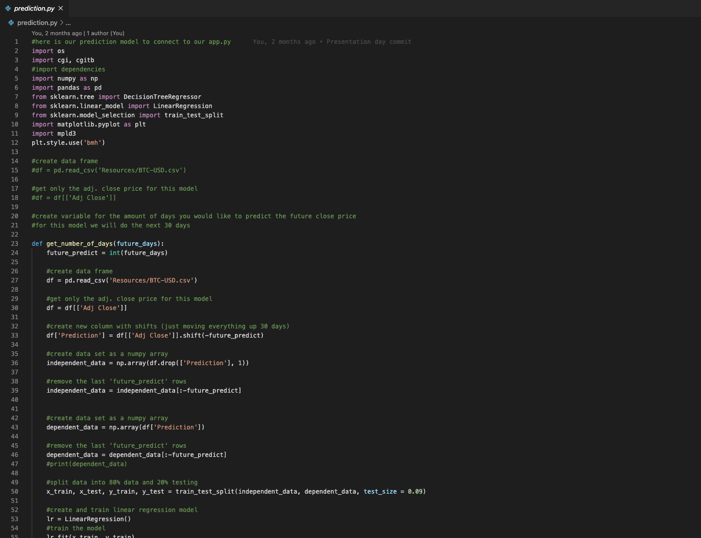
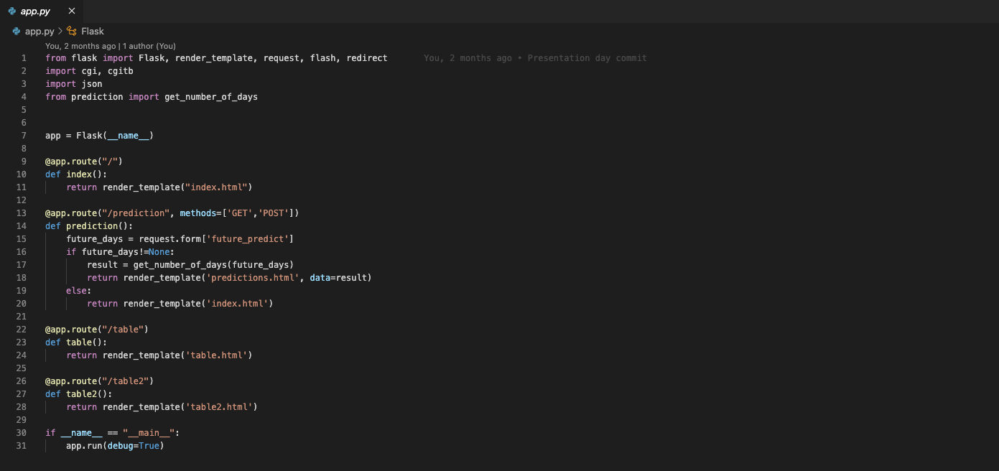
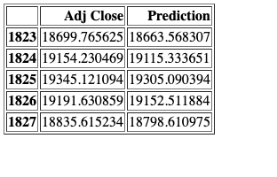
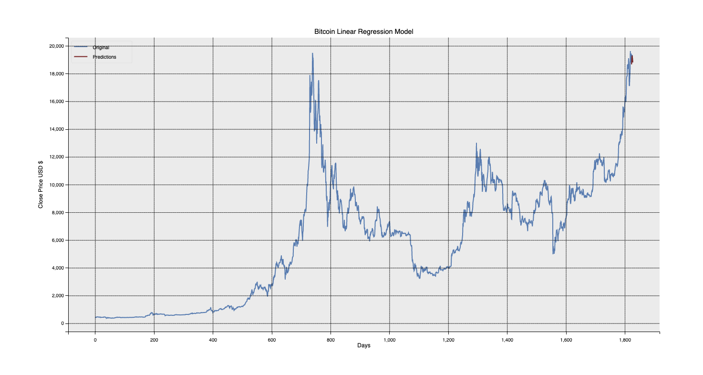

# 📈 Bitcoin Price Prediction with Machine Learning

This project uses historical Bitcoin price data to predict future closing prices using machine learning. It includes data collection, model selection (Linear Regression vs Decision Tree Regressor), and a Flask-based web interface for user interaction.

## 🧠 Project Overview

- **Goal**: Predict future Bitcoin closing prices based on historical trends
- **Approach**: Compare the performance of Linear Regression and Decision Tree Regressor models
- **Interface**: Flask-powered app where users can input the number of future days to forecast

## 📁 Data & Resources

Multiple CSV files were used, containing:
- 1-month, 6-month, and full historical data from Yahoo Finance  
- The best prediction accuracy was achieved using the full dataset  
- A custom Yahoo Finance scraper was built,t but later replaced with CSV downloads

## ⚙️ Model Selection & Testing

Initial testing compared:
- **Linear Regression**
- **Decision Tree Regressor**

Each model was trained and tested on different durations of data. Linear Regression proved more consistent and accurate when trained on the full dataset.

## 🧪 `prediction.py`

The selected model was converted to a standalone script for reuse:
- Accepts user input for `future_days`
- Generates and returns forecasted price values
- Output is passed to the Flask app

📷 

## 🌐 `app.py` – Flask Web App

The Flask app creates a web interface for:
- Home page with context and links
- Results page showing tabulated forecasts and plots
- Routes to integrate `prediction.py` output

📷 

## 🕸️ Web Deployment Preview

Screenshots of the deployed app (hosted locally or via web server):

📷   
📷   
📷   
📷 

## 🔮 Future Improvements

- Add moving averages and trading indicators (RSI, MACD)
- Expand to multivariate forecasting (e.g., volume, other coins)
- Explore LSTM or Prophet for time series predictions
- Deploy using Docker + AWS (or Streamlit Cloud)

## 🛠 Technologies Used

- Python
- Scikit-learn
- Pandas
- Matplotlib
- Flask
- Jupyter Notebook
